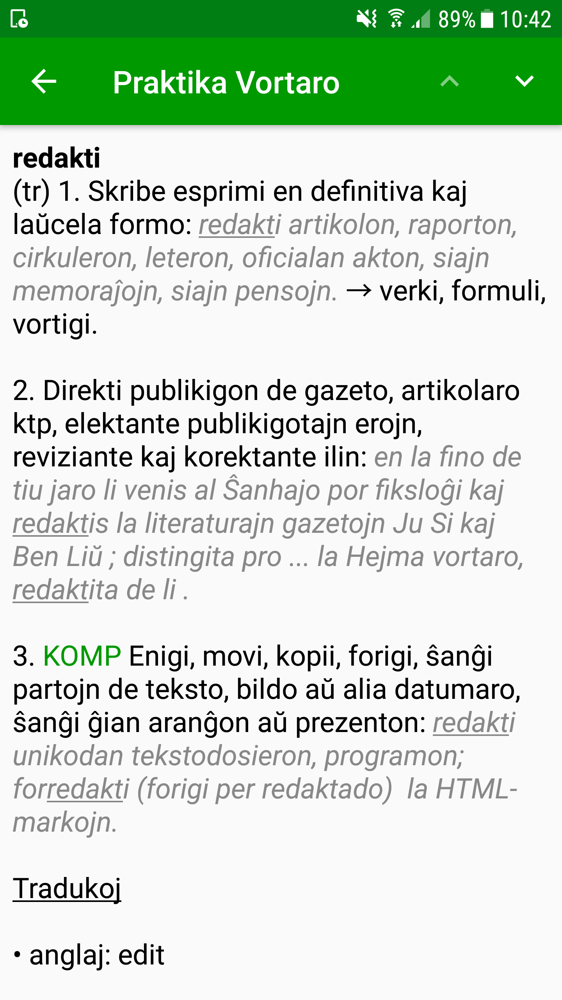
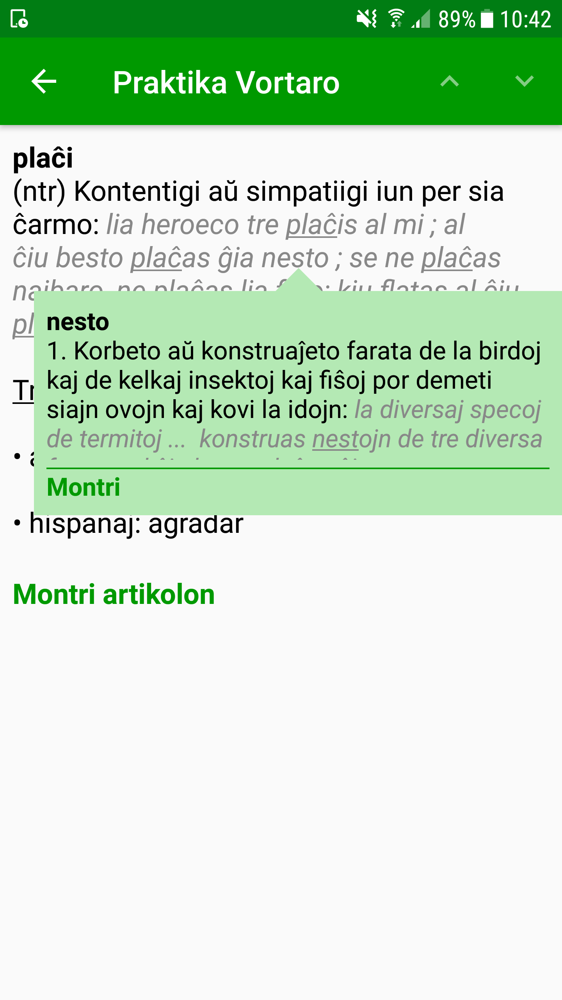

# Praktika Vortaro

This is the repository of the Android application Praktika Vortaro.

## Screenshots

## Build

The sqlite database used is built using https://github.com/djuretic/praktika-vortaro-dicts and copied to `app/src/main/assets/databases/vortaro.db`.

## Update version

Update `app/build.gradle` and bump `versionCode` and `versionName` inside `android.defaultConfig`.

If vortaro.db was updated, also bump `DB_VERSION` in `app/src/main/kotlin/com/esperantajvortaroj/app/db/DatabaseHelper.kt`.

## License

GPL-3.0
